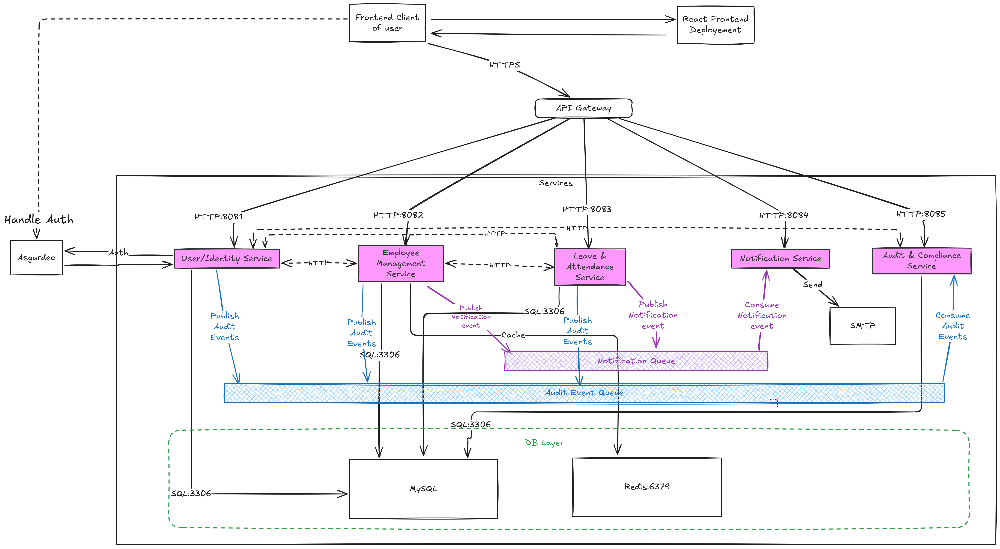

# Human Resource Management System

- Microservice based Human Resource Management System.

**Architecture**

## Infrastructure Diagrams

Detailed Terraform infrastructure diagrams for the HRMS and monitoring components:

### HRMS Kubernetes Infrastructure

### Monitoring Infrastructure

### Combined Infrastructure View

For detailed documentation about the infrastructure, see [Terraform Diagrams Documentation](docs/terraform-diagrams/README.md).

**Status badges**

Below are the build-and-push badges for each service:

