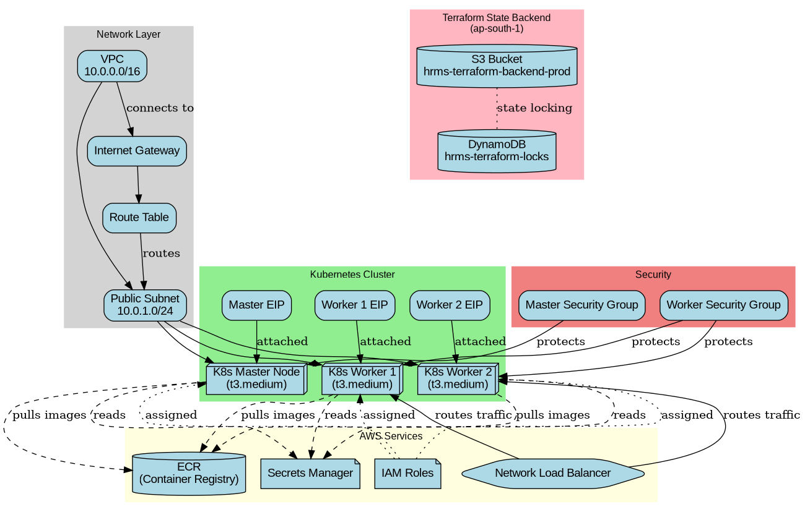
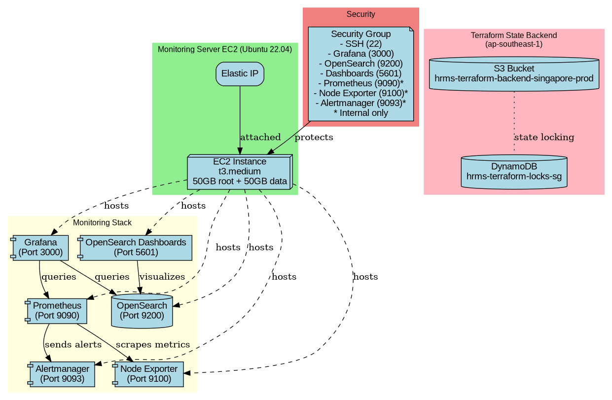
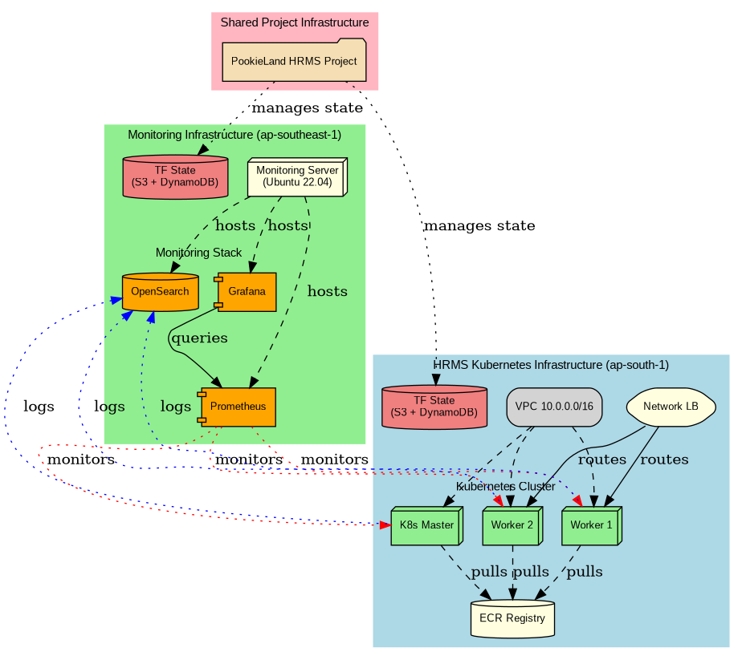

# Terraform Infrastructure Diagrams

This directory contains architecture diagrams for the PookieLand HRMS project infrastructure, created from Terraform configurations and Ansible playbooks.

## 📋 Available Formats

The infrastructure is documented in multiple formats:

1. **ASCII Diagram** (`architecture-ascii.txt`) - Complete text-based architecture overview
2. **Mermaid Diagrams** (`.mermaid` files) - Interactive diagrams that render in GitHub/GitLab
3. **PNG/SVG Diagrams** (`.png`, `.svg` files) - Static image diagrams with icons

## 🎨 ASCII Architecture Overview

For a complete text-based view of the entire architecture, see [`architecture-ascii.txt`](architecture-ascii.txt).

## 📊 Interactive Mermaid Diagrams

Mermaid diagrams render directly in GitHub and many documentation platforms:

- [`hrms-infrastructure.mermaid`](hrms-infrastructure.mermaid) - HRMS Kubernetes cluster
- [`monitoring-infrastructure.mermaid`](monitoring-infrastructure.mermaid) - Monitoring stack
- [`combined-infrastructure.mermaid`](combined-infrastructure.mermaid) - Complete multi-region view

**To view:** Simply click on any `.mermaid` file in GitHub to see the rendered diagram.

## 📐 Diagrams Overview

### 1. HRMS Kubernetes Infrastructure
**File**: `hrms-k8s-infrastructure.png` / `hrms-k8s-infrastructure.svg`

**Location**: AWS ap-south-1 region

**Components**:
- **Network Layer**: VPC (10.0.0.0/16) with Internet Gateway, Public Subnet, and Route Tables
- **Kubernetes Cluster**: 
  - 1x Master Node (t3.medium)
  - 2x Worker Nodes (t3.medium)
  - Elastic IPs for all nodes
- **AWS Services**:
  - ECR (Elastic Container Registry) for container images
  - Network Load Balancer for traffic distribution
  - AWS Secrets Manager for sensitive data
  - IAM Roles for access control
- **Security**: Separate security groups for master and worker nodes
- **Terraform State Backend**: S3 bucket (hrms-terraform-backend-prod) with DynamoDB (hrms-terraform-locks) for state locking

**Key Features**:
- Kubernetes cluster setup with kubeadm
- Flannel CNI for pod networking
- ECR integration for private container images
- Automated secret management
- High availability with multiple worker nodes



---

### 2. Grafana Monitoring Infrastructure
**File**: `grafana-monitoring-infrastructure.png` / `grafana-monitoring-infrastructure.svg`

**Location**: AWS ap-southeast-1 region

**Components**:
- **EC2 Instance**: Ubuntu 22.04 LTS (t3.medium) with 50GB root + 50GB data volumes
- **Monitoring Stack**:
  - **Grafana** (Port 3000): Visualization and dashboards
  - **Prometheus** (Port 9090): Metrics collection and alerting (internal only)
  - **Alertmanager** (Port 9093): Alert handling (internal only)
  - **Node Exporter** (Port 9100): System metrics (internal only)
  - **OpenSearch** (Port 9200): Log aggregation and search
  - **OpenSearch Dashboards** (Port 5601): Log visualization
- **Security**: Security group with controlled access
  - Public access: SSH (22), Grafana (3000), OpenSearch (9200, 5601)
  - Internal only: Prometheus (9090), Node Exporter (9100), Alertmanager (9093)
- **Terraform State Backend**: S3 bucket (hrms-terraform-backend-singapore-prod) with DynamoDB (hrms-terraform-locks-sg) for state locking

**Key Features**:
- Complete observability stack
- Centralized logging with OpenSearch
- Metrics collection and visualization
- Alert management
- Scalable storage with dedicated data volume



---

### 3. Combined Infrastructure
**File**: `combined-infrastructure.png` / `combined-infrastructure.svg`

This diagram shows both infrastructures and their relationships as part of the unified PookieLand HRMS project.

**Key Integrations**:
- **Monitoring**: Prometheus monitors all Kubernetes nodes (master and workers)
- **Logging**: OpenSearch collects logs from all Kubernetes nodes
- **Visualization**: Grafana provides unified dashboards for the entire infrastructure
- **Shared Project**: Both infrastructures are managed as part of the same project with separate Terraform state backends in different regions

**Multi-Region Architecture**:
- **ap-south-1**: Production HRMS Kubernetes cluster
- **ap-southeast-1**: Monitoring and observability infrastructure

**Cross-Infrastructure Communication**:
- Red dotted lines: Monitoring connections (Prometheus → K8s nodes)
- Blue dotted lines: Log shipping (K8s nodes → OpenSearch)



---

## Infrastructure Details

### HRMS Repository
- **Repository**: [PookieLand/HRMS](https://github.com/PookieLand/HRMS)
- **Terraform Path**: `/terraform`
- **Ansible Playbooks**: `/ansible/playbooks`
- **Key Ansible Roles**:
  - `01-prepare-nodes.yml`: Node preparation
  - `02-setup-master.yml`: Kubernetes master initialization
  - `03-setup-workers.yml`: Worker node join
  - `04-deploy-hrms.yml`: HRMS application deployment
  - `05-setup-ecr-refresh.yml`: ECR credentials refresh automation

### Grafana Component Repository
- **Repository**: [PookieLand/grafana-component](https://github.com/PookieLand/grafana-component)
- **Terraform Path**: `/terraform_grafana_ec2`
- **Ansible Playbooks**: `/ansible_grafana_playbooks`
- **Key Ansible Roles**:
  - `install-grafana.yml`: Grafana installation and configuration
  - `install-prometheus.yml`: Prometheus server setup (LTS 3.5.0)
  - `install-alertmanager.yml`: Alert manager configuration
  - `install-node-exporter.yml`: Node exporter deployment
  - `install-opensearch.yml`: OpenSearch installation
  - `install-opensearch-dashboards.yml`: OpenSearch Dashboards setup

---

## Diagram Generation

These diagrams were generated using a custom Python script that analyzes Terraform configuration files and Ansible playbooks to create accurate architectural representations.

**Generation Tool**: Custom Python script using Graphviz
**Last Updated**: 2025-12-19

### Available Formats
- **PNG**: High-resolution raster images suitable for documentation and presentations
- **SVG**: Scalable vector graphics for web use and high-quality printing

---

## Usage in Documentation

To reference these diagrams in your documentation:

```markdown
# Markdown


# HTML

```

---

## Notes

- The Terraform state backends use S3 for storage and DynamoDB for state locking to ensure safe concurrent operations
- Both infrastructures are in separate AWS regions for redundancy and compliance
- The monitoring infrastructure can observe the HRMS infrastructure cross-region
- Security groups are configured to allow internal communication between monitoring and application tiers
- All infrastructure is managed as code through Terraform with state stored securely in AWS

---

## Maintenance

When updating infrastructure:
1. Update Terraform configurations in respective repositories
2. Apply changes using Terraform
3. Regenerate diagrams to reflect new architecture
4. Update this documentation if major changes are made

For questions or updates, please refer to the respective repository READMEs or contact the infrastructure team.
